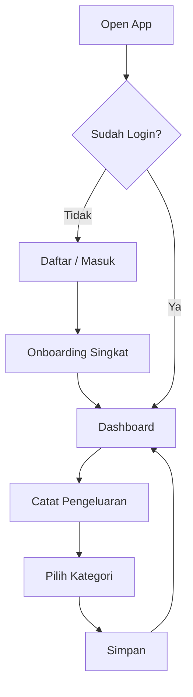
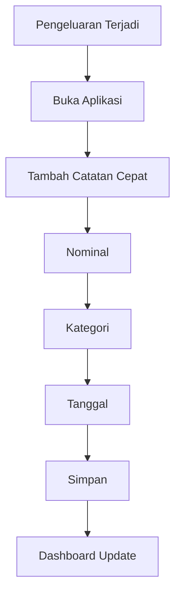
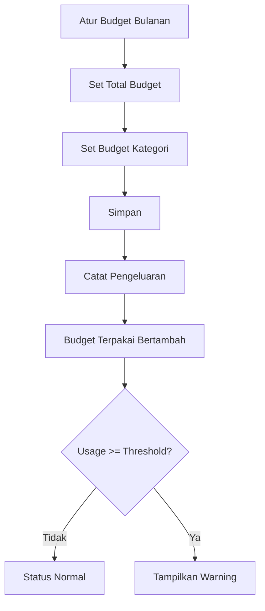
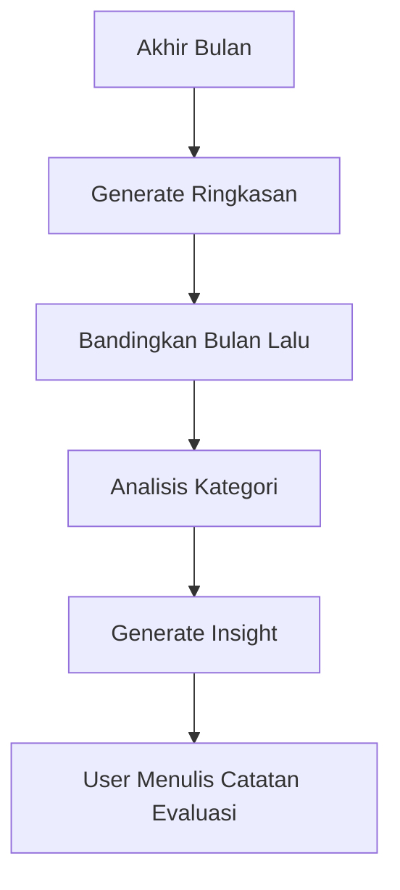
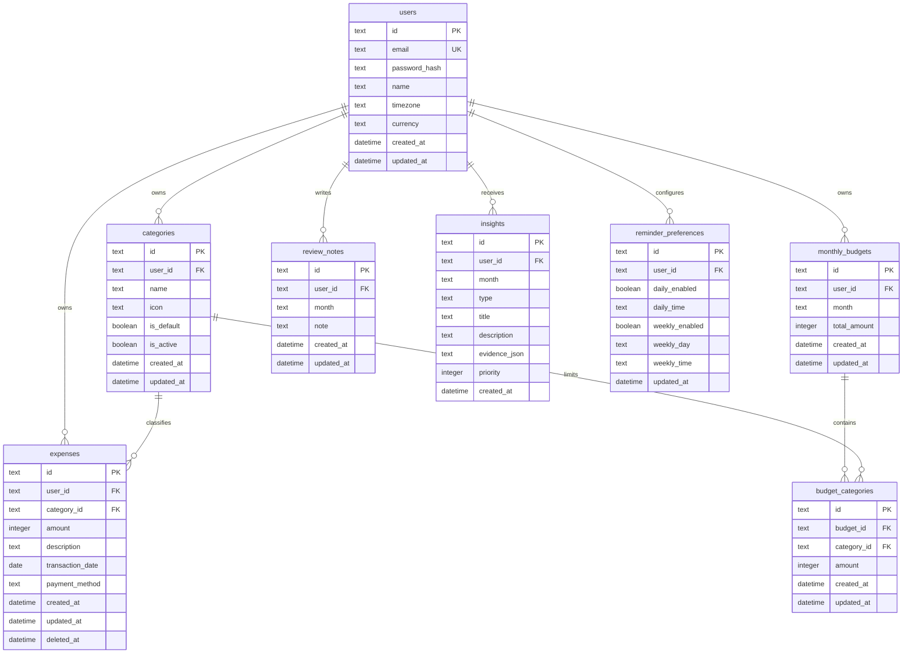
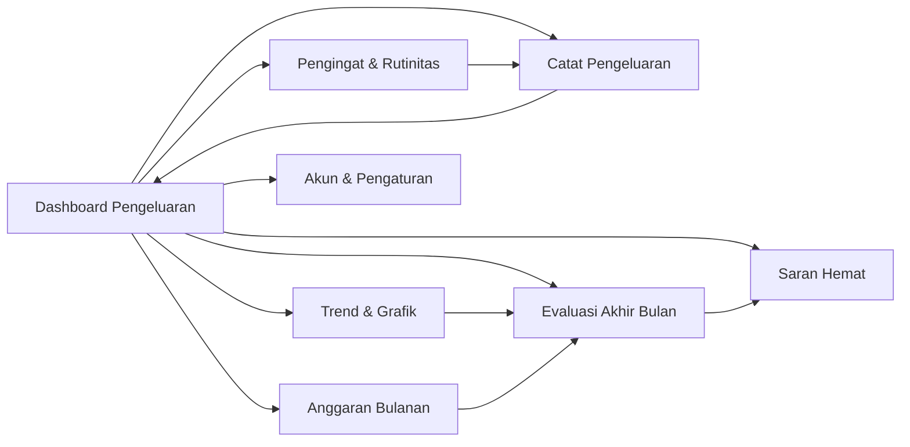

# PRD — Catat Uang Hemat

## 1. Overview

**Catat Uang Hemat** adalah aplikasi pencatatan dan pengelolaan pengeluaran pribadi yang dirancang untuk membantu pengguna mengetahui ke mana uang dibelanjakan, membandingkan pola pengeluaran, mengatur anggaran, serta melakukan evaluasi dan membangun rutinitas finansial.

Produk menggunakan pendekatan **mobile-first**, dengan alur utama sesingkat mungkin: buka aplikasi → catat pengeluaran → lihat kondisi keuangan → evaluasi → perbaiki kebiasaan.

Struktur fitur mengikuti workflow pada rancangan produk yang diberikan, dengan pembagian fase sebagai berikut:

| Fase | Area | Fokus |
|---|---|---|
| Fase 1 | Dashboard Pengeluaran | Monitoring kondisi pengeluaran saat ini |
| Fase 1 | Catat Pengeluaran | Pencatatan transaksi secepat mungkin |
| Fase 2 | Trend & Grafik | Memahami pola pengeluaran |
| Fase 2 | Anggaran Bulanan | Mengontrol batas pengeluaran |
| Fase 3 | Evaluasi Akhir Bulan | Refleksi dan perbandingan hasil |
| Fase 3 | Saran Hemat | Menemukan kebocoran dan peluang efisiensi |
| Fase 4 | Pengingat & Rutinitas | Membentuk kebiasaan pencatatan |
| Fase 4 | Akun & Pengaturan | Pengelolaan akun, preferensi, dan data |

### 1.1 Product Goal

Menyediakan satu tempat yang sederhana untuk:

- mencatat setiap pengeluaran;
- mengetahui total pengeluaran hari ini dan bulan berjalan;
- melihat kategori yang paling banyak menghabiskan uang;
- menetapkan dan memantau anggaran bulanan;
- mengevaluasi pengeluaran setiap akhir bulan;
- mendapatkan saran efisiensi berbasis data transaksi;
- menjaga konsistensi pencatatan melalui pengingat.

### 1.2 Product Principle

1. **Input cepat** — pencatatan transaksi umum idealnya dapat dilakukan dalam beberapa detik.
2. **Mobile first** — fitur utama nyaman digunakan dengan satu tangan pada layar ponsel.
3. **Data-first** — insight harus berasal dari data transaksi yang dimiliki pengguna.
4. **Progressive disclosure** — tampilan awal sederhana; detail tersedia ketika diperlukan.
5. **Tidak menghakimi** — bahasa aplikasi bersifat informatif dan membantu, bukan menyalahkan pengguna.
6. **Local-first friendly** — SQLite menjadi database utama agar aplikasi sederhana, cepat, dan mudah dideploy pada tahap awal.

---

## 2. Target User

### 2.1 Primary User

Pengguna individu yang ingin mengontrol pengeluaran pribadi tanpa membutuhkan aplikasi akuntansi yang kompleks.

### 2.2 User Characteristics

- Sering melakukan transaksi kecil sehari-hari.
- Membutuhkan pencatatan cepat dari smartphone.
- Ingin mengetahui total pengeluaran tanpa melakukan perhitungan manual.
- Belum tentu memahami istilah akuntansi atau budgeting secara mendalam.
- Membutuhkan insight sederhana, bukan laporan keuangan perusahaan.

### 2.3 Jobs To Be Done

> Saat saya mengeluarkan uang, saya ingin mencatatnya dengan cepat supaya saya tidak lupa.

> Saat saya membuka aplikasi, saya ingin langsung mengetahui kondisi pengeluaran saya supaya saya tahu apakah masih aman.

> Saat akhir bulan, saya ingin melihat pola pengeluaran supaya saya tahu bagian mana yang perlu diperbaiki.

---

## 3. Product Scope

### 3.1 In Scope

- Authentication dasar.
- Master kategori pengeluaran.
- Pencatatan transaksi pengeluaran.
- Dashboard pengeluaran.
- Statistik harian dan bulanan.
- Statistik berdasarkan kategori.
- Anggaran bulanan.
- Alert penggunaan anggaran.
- Evaluasi akhir bulan.
- Saran hemat berbasis rule/analisis transaksi.
- Pengingat pencatatan.
- Ringkasan mingguan.
- Preferensi pengguna.
- Ekspor data.

### 3.2 Out of Scope — Initial Product

Fitur berikut tidak menjadi target versi awal kecuali ditambahkan melalui perubahan scope:

- Integrasi rekening bank secara otomatis.
- Open Banking.
- Pembayaran atau transfer uang.
- Investasi dan trading.
- Pinjaman atau kredit scoring.
- Akuntansi bisnis double-entry.
- Multi-currency kompleks.
- Sinkronisasi real-time dengan banyak perangkat secara offline tanpa strategi sync khusus.
- Social/community features.

---

## 4. Requirements

### 4.1 Accessibility

- Web application harus responsif.
- Prioritas desain: viewport mobile mulai sekitar 320–375 px.
- UI tetap usable pada tablet dan desktop.
- Interaksi utama harus memiliki target sentuh yang cukup besar.
- Form tidak boleh membutuhkan banyak langkah tanpa alasan.
- Feedback sukses/gagal harus terlihat jelas.

### 4.2 User

Versi awal menggunakan satu akun pengguna untuk data pribadi.

Data transaksi pengguna **harus terisolasi secara logis** berdasarkan `user_id`, sehingga arsitektur tetap dapat dikembangkan ke multi-user tanpa perubahan fundamental pada domain.

### 4.3 Currency

Default currency: **IDR (Rupiah)**.

Representasi nominal di backend menggunakan integer dalam satuan rupiah untuk menghindari masalah floating point.

Contoh:

```text
Rp25.000 -> amount = 25000
Rp125.500 -> amount = 125500
```

### 4.4 Date & Time

- Default timezone: `Asia/Jakarta`.
- Transaksi menyimpan tanggal transaksi (`transaction_date`).
- Audit data menyimpan timestamp UTC atau timestamp dengan strategi konsisten yang ditentukan implementasi.
- Perhitungan dashboard berdasarkan timezone user.

---

# 5. Core Features

## 5.1 Dashboard Pengeluaran — Fase 1

Dashboard adalah halaman utama setelah login.

### Tujuan

Memberikan gambaran kondisi pengeluaran tanpa meminta user membuka banyak halaman.

### Sub Fitur

#### A. Grafik Bulan Ini

Menampilkan total pengeluaran per hari untuk bulan aktif.

Minimum:

- total pengeluaran bulan berjalan;
- grafik tren harian;
- label tanggal yang adaptif pada mobile;
- kemampuan memilih rentang jika diperlukan pada versi lanjutan.

#### B. Ringkasan Hari Ini

Menampilkan:

- total pengeluaran hari ini;
- jumlah transaksi hari ini;
- kategori dengan pengeluaran terbesar hari ini, jika ada.

#### C. Transaksi Terakhir

Menampilkan daftar transaksi terbaru dengan:

- nama/keterangan;
- kategori;
- nominal;
- tanggal/jam;
- opsi melihat detail.

### Acceptance Criteria

- User yang login langsung dapat melihat total bulan berjalan.
- Total dashboard konsisten dengan transaksi yang tersimpan.
- Transaksi terbaru terurut dari yang paling baru.
- State kosong tetap informatif ketika belum ada transaksi.

---

## 5.2 Catat Pengeluaran — Fase 1

Ini adalah core interaction produk.

### Sub Fitur

#### A. Tambah Catatan Cepat

Form minimal:

- Nominal.
- Keterangan.
- Kategori.
- Tanggal.

Optional:

- Catatan tambahan.
- Metode pembayaran.

Default tanggal = hari ini.

#### B. Pilih Kategori

Kategori harus dapat dipilih dengan cepat.

Kategori default dapat meliputi:

- Makanan & Minuman
- Transportasi
- Belanja
- Tagihan
- Kesehatan
- Hiburan
- Pendidikan
- Rumah Tangga
- Lainnya

Daftar default bersifat seed data dan dapat dikembangkan menjadi kategori custom.

#### C. Ubah & Hapus Catatan

User dapat:

- membuka detail transaksi;
- mengubah nominal, kategori, tanggal, atau keterangan;
- menghapus transaksi dengan konfirmasi.

Penghapusan sebaiknya menggunakan **soft delete** atau mekanisme audit yang tidak menghilangkan histori secara permanen pada level persistence jika diperlukan untuk recovery.

### Acceptance Criteria

- Nominal wajib > 0.
- Kategori wajib dipilih.
- Tanggal transaksi valid.
- Setelah transaksi tersimpan, dashboard otomatis ter-update.
- Edit transaksi memengaruhi agregasi harian, bulanan, kategori, dan budget.
- Hapus transaksi memengaruhi agregasi yang relevan.

---

## 5.3 Trend & Grafik — Fase 2

Tujuan fitur ini adalah mengubah transaksi menjadi informasi yang mudah dipahami.

### Sub Fitur

#### A. Trend Harian

Menampilkan pengeluaran per hari berdasarkan periode yang dipilih.

#### B. Trend Bulanan

Membandingkan total pengeluaran beberapa bulan.

Minimum periode awal: 6–12 bulan berdasarkan ketersediaan data.

#### C. Rincian per Kategori

Menampilkan distribusi pengeluaran per kategori.

Data dapat divisualisasikan sebagai:

- bar chart;
- donut/pie chart untuk distribusi;
- daftar kategori dengan nominal dan persentase.

### Functional Requirements

- Semua angka grafik dihitung dari transaksi yang aktif.
- Filter periode memengaruhi seluruh komponen dalam konteks halaman.
- Kategori tanpa transaksi tidak perlu ditampilkan pada chart utama.

---

## 5.4 Anggaran Bulanan — Fase 2

Budget membantu user menetapkan batas pengeluaran sebelum uang habis.

### Sub Fitur

#### A. Atur Anggaran Bulan

User dapat menetapkan:

- total anggaran bulanan;
- periode bulan;
- opsi nominal default/berulang untuk bulan berikutnya pada versi lanjutan.

#### B. Anggaran per Kategori

User dapat menentukan batas per kategori.

Contoh:

```text
Total Budget       Rp5.000.000
Makanan            Rp1.500.000
Transportasi         Rp750.000
Hiburan              Rp300.000
Belanja             Rp1.000.000
Lainnya             Rp1.450.000
```

#### C. Peringatan Hampir Habis

Status penggunaan budget:

| Usage | Status Domain |
|---:|---|
| < 70% | Normal |
| 70%–89% | Warning |
| 90%–99% | Critical |
| >= 100% | Exceeded |

Threshold dapat dikonfigurasi pada masa depan.

### Acceptance Criteria

- Total terpakai dihitung dari transaksi dalam periode budget.
- Budget kategori hanya menghitung transaksi kategori yang sesuai.
- Status berubah otomatis saat transaksi bertambah, diedit, atau dihapus.
- User dapat melihat nominal budget, terpakai, sisa, dan persentase penggunaan.

---

## 5.5 Evaluasi Akhir Bulan — Fase 3

Fitur untuk membantu user melihat hasil bulan yang telah selesai.

### Sub Fitur

#### A. Ringkasan Bulan Ini

Menampilkan:

- total pengeluaran;
- jumlah transaksi;
- rata-rata pengeluaran per hari;
- kategori terbesar;
- budget vs actual jika budget tersedia.

#### B. Perbandingan Bulan Lalu

Menampilkan perubahan absolut dan persentase:

```text
Bulan lalu : Rp4.200.000
Bulan ini  : Rp3.800.000
Selisih    : -Rp400.000
Perubahan  : -9,52%
```

Bahasa UI sebaiknya menyampaikan fakta angka terlebih dahulu dan tidak memberikan penilaian moral terhadap perilaku pengguna.

#### C. Catatan Evaluasi

User dapat menulis catatan manual, misalnya:

> Bulan ini pengeluaran transportasi naik karena perjalanan dinas.

Catatan terhubung ke periode bulan yang dievaluasi.

---

## 5.6 Saran Hemat — Fase 3

Sistem memberikan insight berdasarkan data historis pengguna.

### Sub Fitur

#### A. Kesimpulan Otomatis

Versi awal menggunakan **rule-based insights**, bukan AI generatif.

Contoh rule:

```text
Jika kategori X > 30% total pengeluaran
=> tampilkan insight bahwa X merupakan kategori terbesar.

Jika kategori X naik > 20% dibanding rata-rata 3 bulan
=> tampilkan insight kenaikan kategori.

Jika transaksi kecil berulang pada kategori tertentu sangat banyak
=> tampilkan insight mengenai frekuensi transaksi.
```

#### B. Deteksi Kebocoran

Kebocoran adalah pola pengeluaran yang memenuhi rule tertentu, contohnya:

- kenaikan kategori berulang;
- transaksi kecil yang terlalu sering;
- subscription/tagihan yang meningkat;
- kategori melewati budget.

Sistem harus menampilkan **evidence** angka yang menjadi dasar insight.

Contoh:

```text
Transportasi naik 28% dibanding rata-rata 3 bulan terakhir.
Rata-rata: Rp420.000
Bulan ini: Rp537.000
```

#### C. Rekomendasi Efisiensi

Rekomendasi harus berupa saran berbasis data, misalnya:

```text
Pengeluaran makanan menyumbang 37% dari total bulan ini.
Pertimbangkan menetapkan budget kategori yang lebih spesifik bulan depan.
```

AI generatif dapat menjadi extension point di masa depan, tetapi domain service tetap menghasilkan data/fakta terstruktur terlebih dahulu.

---

## 5.7 Pengingat & Rutinitas — Fase 4

### Sub Fitur

#### A. Pengingat Catat Harian

User dapat menentukan:

- aktif/nonaktif;
- jam pengingat;
- timezone.

Contoh default:

```text
20:00 WIB — "Sudah mencatat pengeluaran hari ini?"
```

#### B. Ringkasan Mingguan

Menampilkan ringkasan 7 hari terakhir:

- total pengeluaran;
- jumlah transaksi;
- kategori terbesar;
- perbandingan dengan minggu sebelumnya bila tersedia.

Delivery awal dapat menggunakan notification/email sesuai capability sistem; arsitektur harus memisahkan domain reminder dari channel delivery.

---

## 5.8 Akun & Pengaturan — Fase 4

### Sub Fitur

#### A. Daftar & Masuk

Authentication menggunakan:

- email;
- password.

Password wajib disimpan dalam bentuk hash, bukan plaintext.

#### B. Atur Preferensi

Minimum:

- currency;
- timezone;
- tema UI;
- preferensi reminder;
- awal periode bulan bila nantinya diperlukan.

#### C. Ekspor Data

User dapat mengekspor transaksi ke CSV.

Minimum kolom:

```text
transaction_id,date,description,category,amount,payment_method,created_at
```

Versi lanjutan dapat menambahkan JSON export dan full backup.

---

# 6. User Flow

## 6.1 First Time User



## 6.2 Daily Flow



## 6.3 Budget Flow



## 6.4 Monthly Review Flow



---

# 7. Information Architecture

```text
/
├── login
├── register
├── dashboard
├── expenses
│   ├── new
│   ├── :id
│   └── :id/edit
├── trends
├── budgets
│   ├── current
│   └── :month
├── review
│   └── :month
├── insights
├── reminders
└── settings
    ├── profile
    ├── preferences
    └── export
```

### Mobile Navigation

Prioritas bottom navigation:

```text
[Dashboard] [Catat] [Trend] [Budget] [Lainnya]
```

Tombol **Catat** harus menjadi primary action yang mudah ditemukan.

Pada desktop, navigasi dapat berubah menjadi sidebar.

---

# 8. Functional Requirements

## FR-01 Authentication

- User dapat register.
- User dapat login.
- User dapat logout.
- Session/token harus divalidasi untuk endpoint protected.
- User hanya dapat membaca dan memodifikasi data miliknya.

## FR-02 Category

- Sistem menyediakan default categories.
- User dapat melihat kategori aktif.
- Versi lanjutan dapat menambah/edit/archive custom category.

## FR-03 Expense Transaction

Field minimum:

| Field | Required | Type |
|---|---|---|
| id | Yes | UUID/Text |
| user_id | Yes | FK |
| category_id | Yes | FK |
| amount | Yes | Integer |
| description | Yes | Text |
| transaction_date | Yes | Date |
| payment_method | No | Text/Enum |
| created_at | Yes | Timestamp |
| updated_at | Yes | Timestamp |
| deleted_at | No | Timestamp |

## FR-04 Dashboard Aggregation

Sistem harus menyediakan agregasi:

- today total;
- today transaction count;
- current month total;
- current month daily series;
- recent transactions;
- top categories.

## FR-05 Budget

Field minimum:

| Field | Type |
|---|---|
| id | UUID/Text |
| user_id | FK |
| month | YYYY-MM |
| total_amount | Integer |
| created_at | Timestamp |
| updated_at | Timestamp |

Budget kategori:

| Field | Type |
|---|---|
| id | UUID/Text |
| budget_id | FK |
| category_id | FK |
| amount | Integer |
|

Constraint bisnis:

- hanya satu total budget aktif untuk user + month;
- budget kategori dapat lebih dari satu;
- total budget kategori boleh divalidasi agar tidak melebihi total budget sesuai keputusan product.

## FR-06 Review

Sistem dapat membuat ringkasan berdasarkan period:

```text
period_start
period_end
current_total
previous_total
absolute_change
percentage_change
transaction_count
average_daily_spend
```

## FR-07 Insights

Insight harus menyimpan:

- jenis insight;
- periode;
- severity/display priority;
- data pendukung;
- status apakah sudah dibaca.

## FR-08 Reminder

Sistem menyimpan konfigurasi reminder per user.

Reminder engine tidak boleh bercampur dengan domain expense transaction.

## FR-09 Export

Export harus menghormati `user_id` dan hanya menghasilkan data milik user yang meminta.

---

# 9. Domain Model — DDD

Arsitektur menggunakan **Domain-Driven Design**. Domain harus menjadi sumber aturan bisnis, sementara framework dan database hanya menjadi detail implementasi.

## 9.1 Bounded Context

### Expense Context

Tanggung jawab:

- expense transaction;
- category;
- expense query.

### Budget Context

Tanggung jawab:

- monthly budget;
- category budget;
- budget utilization.

### Insight Context

Tanggung jawab:

- trend calculation;
- monthly review;
- insight detection;
- recommendation rules.

### Reminder Context

Tanggung jawab:

- reminder schedule;
- weekly summary trigger;
- notification preparation.

### Identity Context

Tanggung jawab:

- user;
- authentication;
- session.

### Reporting / Export Context

Tanggung jawab:

- CSV export;
- read-model/query projection bila diperlukan.

---

## 9.2 Aggregate

Aggregate utama:

### Expense

Aggregate root: `Expense`

Value Objects yang mungkin:

- `Money`
- `ExpenseDescription`
- `TransactionDate`

### Budget

Aggregate root: `MonthlyBudget`

Entity:

- `BudgetCategory`

Value Objects:

- `Money`
- `MonthPeriod`

### Reminder

Aggregate root: `ReminderPreference`

### User

Aggregate root: `User`

---

## 9.3 Domain Services

Contoh domain/application services:

```text
CreateExpenseService
UpdateExpenseService
DeleteExpenseService
GetDashboardSummaryService
CalculateMonthlyTrendService
CreateMonthlyBudgetService
CalculateBudgetUsageService
GenerateMonthlyReviewService
GenerateExpenseInsightsService
ScheduleReminderService
ExportExpenseDataService
```

Service tidak boleh menjadi tempat untuk semua logic secara acak. Business invariants yang benar-benar milik domain harus ditempatkan pada entity/value object/domain service yang sesuai.

---

## 9.4 Domain Events

Event yang disiapkan untuk kebutuhan extensibility:

```text
ExpenseRecorded
ExpenseUpdated
ExpenseDeleted
BudgetCreated
BudgetUpdated
BudgetExceeded
MonthlyReviewGenerated
InsightGenerated
ReminderTriggered
```

Event dapat digunakan untuk update read model, insight cache, notification, dan analytics tanpa membuat aggregate saling bergantung secara langsung.

---

# 10. Technical Architecture

## 10.1 Technology Stack

### Frontend

- **Svelte**
- **Tailwind CSS**
- TypeScript
- SvelteKit dapat digunakan sebagai application framework apabila dibutuhkan routing, SSR, dan deployment integration.

### Backend

- **ElysiaJS**
- **Bun Runtime**
- TypeScript

### Database

- **SQLite**
- **Drizzle ORM**
- Drizzle Kit untuk migration/schema management.

### Architecture

- Domain-Driven Design.
- Layered / modular architecture.
- API-first communication antara frontend dan backend.

---

# 11. Backend Layering

Direkomendasikan struktur:

```text
src/
├── modules/
│   ├── identity/
│   │   ├── domain/
│   │   ├── application/
│   │   ├── infrastructure/
│   │   └── presentation/
│   ├── expense/
│   │   ├── domain/
│   │   ├── application/
│   │   ├── infrastructure/
│   │   └── presentation/
│   ├── budget/
│   ├── insight/
│   ├── reminder/
│   └── reporting/
│
├── shared/
│   ├── domain/
│   ├── infrastructure/
│   └── presentation/
│
├── db/
│   ├── schema/
│   ├── migrations/
│   └── client.ts
│
└── main.ts
```

Prinsip dependency:

```text
Presentation
    ↓
Application
    ↓
Domain
    ↑
Infrastructure
```

Domain tidak boleh mengimpor Drizzle, Elysia, atau browser-specific code.

---

# 12. Frontend Architecture

Direkomendasikan feature-oriented structure:

```text
src/
├── lib/
│   ├── api/
│   ├── components/
│   ├── forms/
│   ├── stores/
│   └── utils/
│
├── routes/
│   ├── (auth)/
│   ├── dashboard/
│   ├── expenses/
│   ├── trends/
│   ├── budgets/
│   ├── review/
│   ├── insights/
│   └── settings/
│
└── app.html
```

UI state harus dipisahkan dari server state bila kompleksitas meningkat.

Loading, error, empty, success, dan offline-ish state harus dirancang sejak awal.

---

# 13. API Design

Base path:

```text
/api/v1
```

## Authentication

```http
POST /api/v1/auth/register
POST /api/v1/auth/login
POST /api/v1/auth/logout
GET  /api/v1/auth/me
```

## Categories

```http
GET /api/v1/categories
```

## Expenses

```http
GET    /api/v1/expenses
POST   /api/v1/expenses
GET    /api/v1/expenses/:id
PATCH  /api/v1/expenses/:id
DELETE /api/v1/expenses/:id
```

Query example:

```http
GET /api/v1/expenses?from=2026-09-01&to=2026-09-30&category_id=food
```

## Dashboard

```http
GET /api/v1/dashboard/summary
GET /api/v1/dashboard/daily
GET /api/v1/dashboard/recent
```

## Trends

```http
GET /api/v1/trends/daily
GET /api/v1/trends/monthly
GET /api/v1/trends/categories
```

## Budgets

```http
GET   /api/v1/budgets/:month
POST  /api/v1/budgets
PATCH /api/v1/budgets/:id
GET   /api/v1/budgets/:month/usage
```

## Review & Insights

```http
GET /api/v1/reviews/:month
PUT /api/v1/reviews/:month/note
GET /api/v1/insights/:month
```

## Reminders

```http
GET   /api/v1/reminders
PUT   /api/v1/reminders
POST  /api/v1/reminders/test
```

## Export

```http
POST /api/v1/exports/expenses
```

---

# 14. API Response Convention

Success:

```json
{
  "success": true,
  "data": {},
  "meta": {}
}
```

Error:

```json
{
  "success": false,
  "error": {
    "code": "EXPENSE_AMOUNT_INVALID",
    "message": "Nominal pengeluaran harus lebih dari 0",
    "fields": {
      "amount": "Harus lebih dari 0"
    }
  }
}
```

Error code harus stabil sehingga frontend tidak bergantung pada parsing string message.

---

# 15. Database Schema

Contoh schema logical level:



### 15.1 SQLite / Drizzle Notes

- Gunakan migration versioned.
- Aktifkan foreign key enforcement.
- Tambahkan index untuk query berdasarkan `user_id` + tanggal.
- Tambahkan index kategori dan bulan untuk aggregate query.
- Hindari menyimpan nominal sebagai floating point.
- `evidence_json` digunakan untuk data pendukung insight yang tidak perlu menjadi kolom permanen pada MVP.

Recommended indexes:

```text
expenses(user_id, transaction_date)
expenses(user_id, category_id, transaction_date)
monthly_budgets(user_id, month)
review_notes(user_id, month)
insights(user_id, month)
```

Unique constraints:

```text
users.email
monthly_budgets(user_id, month)
```

---

# 16. Business Rules

## BR-01 Expense

- Amount harus integer positif.
- Category harus aktif dan boleh digunakan user.
- User hanya dapat memodifikasi expense miliknya.
- Transaction date tidak boleh invalid.

## BR-02 Dashboard

- Hanya expense aktif yang masuk agregasi.
- Expense yang dihapus tidak dihitung.
- Semua agregasi menggunakan timezone user.

## BR-03 Budget

- Budget berlaku pada satu bulan kalender.
- Pengeluaran kategori dihitung ke budget total dan budget kategori terkait.
- Penggunaan budget = actual / limit × 100.

## BR-04 Review

- Perbandingan bulan lalu hanya dilakukan jika ada periode referensi yang valid.
- Jika tidak ada data bulan sebelumnya, UI harus menyatakan data tidak tersedia, bukan menganggap perubahan = 0%.

## BR-05 Insight

- Setiap insight harus dapat ditelusuri ke data pendukung.
- Insight bukan pengganti data transaksi.
- Rule yang sama harus menghasilkan hasil yang deterministik untuk input yang sama.

---

# 17. UI / UX Specification

## 17.1 Design Direction

Gaya visual mengikuti referensi workflow yang dilampirkan: sederhana, modular, dark-friendly, dengan hierarki card yang jelas.

Untuk implementasi produk:

- gunakan Tailwind CSS;
- gunakan spacing konsisten;
- gunakan card untuk summary/insight;
- gunakan chart dengan label minimal namun terbaca;
- gunakan bottom navigation pada mobile;
- gunakan sticky primary action pada halaman input bila diperlukan.

## 17.2 Dashboard Mobile

Prioritas urutan:

```text
Header
↓
Ringkasan Hari Ini
↓
Total Bulan Ini
↓
Grafik Bulan Ini
↓
Budget Progress
↓
Insight penting
↓
Transaksi Terakhir
```

## 17.3 Add Expense UX

Input utama harus berada di area awal layar:

```text
[ Rp 125.000 ]

[Makan Siang          ]

[ Makanan & Minuman ]

[ Hari ini           ]

[ SIMPAN PENGELUARAN ]
```

Keyboard numeric harus digunakan pada nominal di mobile.

## 17.4 Empty State

Contoh:

```text
Belum ada pengeluaran hari ini.
Catat transaksi pertama kamu.
[ + Catat Pengeluaran ]
```

## 17.5 Loading State

Gunakan skeleton/loading indicator pada dashboard dan chart, bukan halaman kosong.

---

# 18. Non-Functional Requirements

## 18.1 Performance

Target awal:

- API p95 untuk query sederhana < 300 ms pada environment normal.
- Create expense p95 < 500 ms.
- Dashboard query tetap responsif pada setidaknya puluhan ribu transaksi per user.
- Frontend menghindari bundle berlebihan.

Target ini merupakan engineering target awal, bukan SLA eksternal.

## 18.2 Reliability

- Transaction write harus atomic.
- Update/delete expense harus menghasilkan agregasi yang konsisten.
- Migration harus repeatable dan versioned.
- Error tidak boleh menyebabkan data transaksi setengah tersimpan.

## 18.3 Security

- Password di-hash dengan algoritma password hashing modern.
- Authentication cookie/token harus memiliki expiry dan mekanisme revocation yang sesuai desain.
- Validasi ownership pada setiap query protected.
- Rate limit login.
- Input validation di server wajib.
- Cegah mass assignment melalui DTO/command object eksplisit.
- Jangan expose password hash maupun secret ke client.
- Export data wajib melewati authorization.

## 18.4 Privacy

Data pengeluaran merupakan data pribadi.

Prinsip:

- hanya mengumpulkan data yang diperlukan;
- tidak menggunakan data transaksi untuk tujuan lain tanpa dasar/izin yang sesuai;
- minimalkan logging informasi sensitif;
- audit akses data penting.

---

# 19. Testing Strategy

## 19.1 Unit Test

Fokus domain:

- Money validation.
- Budget calculation.
- Percentage calculation.
- Month comparison.
- Insight rules.
- Reminder schedule rules.

## 19.2 Integration Test

- Expense repository + SQLite.
- Budget repository + SQLite.
- Authentication persistence.
- API use case end-to-end.

## 19.3 E2E Test

Flow minimum:

```text
Register
→ Login
→ Create Expense
→ Dashboard update
→ Edit Expense
→ Budget usage update
→ Generate review
→ Export CSV
```

## 19.4 Test Data

Sediakan fixture:

- empty user;
- normal month;
- high-spending month;
- month without previous data;
- budget exceeded;
- multiple categories;
- soft-deleted transaction.

---

# 20. Observability & Logging

Minimum structured log fields:

```text
request_id
user_id (non-sensitive identifier)
route
method
status_code
duration_ms
error_code
```

Jangan mencatat:

- password;
- authentication secret;
- session token;
- full sensitive payload jika tidak diperlukan.

Backend juga perlu memiliki health check:

```http
GET /health
```

Expected response:

```json
{
  "status": "ok"
}
```

---

# 21. Deployment Architecture

Tahap awal dapat menggunakan satu server/container:

```text
                ┌──────────────────┐
                │      Browser     │
                │   Mobile First   │
                └────────┬─────────┘
                         │ HTTPS
                         ▼
                ┌──────────────────┐
                │ Reverse Proxy    │
                │   Nginx/Caddy    │
                └────────┬─────────┘
                         │
              ┌──────────┴──────────┐
              ▼                     ▼
      ┌────────────────┐   ┌────────────────┐
      │ Svelte Frontend│   │ Elysia + Bun   │
      └────────────────┘   └───────┬────────┘
                                    │
                                    ▼
                            ┌───────────────┐
                            │ SQLite +      │
                            │ Drizzle ORM   │
                            └───────────────┘
```

### Backup SQLite

SQLite file harus memiliki backup berkala.

Minimum:

- daily backup;
- retention policy;
- backup verification.

Untuk produksi, backup jangan disimpan hanya pada disk yang sama dengan database.

---

# 22. Suggested Project Monorepo

```text
catat-uang-hemat/
├── apps/
│   ├── web/
│   │   ├── src/
│   │   └── package.json
│   │
│   └── api/
│       ├── src/
│       └── package.json
│
├── packages/
│   ├── shared/
│   │   ├── schemas/
│   │   └── types/
│   └── eslint-config/
│
├── drizzle/
│   └── migrations/
│
├── docs/
│   └── prd.md
│
├── package.json
├── bun.lock
└── README.md
```

Shared package hanya berisi contract/types/schemas yang benar-benar lintas aplikasi. Domain logic tetap berada pada backend domain modules.

---

# 23. Development Guidelines

## Backend

1. Elysia route handler harus tipis.
2. Route handler memanggil application use case.
3. Business rule berada di domain/application layer sesuai ownership-nya.
4. Drizzle repository hanya mengurus persistence.
5. DTO request/response tidak langsung dijadikan domain entity.
6. Hindari query database tersebar di controller/route.

Contoh alur:

```text
HTTP Request
    ↓
Elysia Controller / Handler
    ↓
Command DTO
    ↓
Application Use Case
    ↓
Domain Entity / Service
    ↓
Repository Interface
    ↓
Drizzle Repository
    ↓
SQLite
```

## Frontend

1. UI component tidak langsung membuat SQL/query database.
2. Semua komunikasi backend melalui typed API client.
3. Form validation client hanya untuk UX; server tetap melakukan validation.
4. Format Rupiah ditangani oleh utility formatter.
5. Chart component menerima data yang sudah dinormalisasi.

---

# 24. MVP Roadmap

## Fase 1 — Core

### Release Goal
User sudah dapat mencatat pengeluaran dan melihat kondisi pengeluaran saat ini.

Deliverables:

- Register/Login.
- Category seed.
- Tambah pengeluaran.
- Edit/hapus pengeluaran.
- Dashboard.
- Ringkasan hari ini.
- Grafik bulan ini.
- Transaksi terakhir.

### Definition of Done

User dapat menyelesaikan flow:

```text
Login → Catat pengeluaran → Simpan → Dashboard berubah
```

## Fase 2 — Control

Deliverables:

- Trend harian.
- Trend bulanan.
- Rincian kategori.
- Monthly budget.
- Category budget.
- Warning budget.

## Fase 3 — Insight

Deliverables:

- Monthly review.
- Comparison with previous month.
- Evaluation note.
- Rule-based automatic conclusion.
- Leakage detection.
- Efficiency recommendations.

## Fase 4 — Habit & Account

Deliverables:

- Daily reminder.
- Weekly summary.
- Preferences.
- Export CSV.
- Account management improvements.

---

# 25. Product Backlog Prioritas

| ID | Story | Phase | Priority |
|---|---|---|---|
| EXP-001 | Sebagai user saya dapat login | 1 | Core |
| EXP-002 | Sebagai user saya dapat menambah pengeluaran | 1 | Core |
| EXP-003 | Sebagai user saya dapat melihat transaksi terakhir | 1 | Core |
| EXP-004 | Sebagai user saya dapat melihat total hari ini | 1 | Core |
| EXP-005 | Sebagai user saya dapat melihat grafik bulan ini | 1 | Core |
| EXP-006 | Sebagai user saya dapat mengedit pengeluaran | 1 | Core |
| EXP-007 | Sebagai user saya dapat menghapus pengeluaran | 1 | Core |
| TRD-001 | Sebagai user saya dapat melihat trend harian | 2 | High |
| TRD-002 | Sebagai user saya dapat melihat trend bulanan | 2 | High |
| TRD-003 | Sebagai user saya dapat melihat rincian per kategori | 2 | High |
| BUD-001 | Sebagai user saya dapat menetapkan budget bulanan | 2 | High |
| BUD-002 | Sebagai user saya dapat menetapkan budget kategori | 2 | High |
| BUD-003 | Sistem memberi peringatan ketika budget hampir habis | 2 | High |
| REV-001 | User dapat melihat review bulanan | 3 | Medium |
| REV-002 | User dapat membandingkan dengan bulan lalu | 3 | Medium |
| REV-003 | User dapat menulis catatan evaluasi | 3 | Medium |
| INS-001 | Sistem membuat insight otomatis | 3 | Medium |
| INS-002 | Sistem mendeteksi pola kebocoran | 3 | Medium |
| INS-003 | Sistem memberi rekomendasi efisiensi | 3 | Medium |
| REM-001 | User dapat mengatur pengingat harian | 4 | Low |
| REM-002 | User dapat menerima ringkasan mingguan | 4 | Low |
| SET-001 | User dapat mengatur preferensi | 4 | Low |
| SET-002 | User dapat mengekspor CSV | 4 | Low |

---

# 26. Acceptance Test Utama

## Scenario 1 — Create Expense

**Given** user sudah login

**When** user memasukkan:

```text
amount = 25000
category = Makanan
transaction_date = hari ini
description = Kopi
```

**Then**:

- expense tersimpan;
- total hari ini bertambah Rp25.000;
- total bulan berjalan bertambah Rp25.000;
- transaksi muncul di transaksi terakhir.

## Scenario 2 — Edit Expense

**Given** expense Rp25.000

**When** user mengubah menjadi Rp35.000

**Then** semua aggregate yang relevan berubah sebesar +Rp10.000.

## Scenario 3 — Budget Warning

**Given** budget kategori Rp1.000.000

**When** actual mencapai Rp920.000

**Then** status budget menjadi `critical` sesuai threshold default 90%.

## Scenario 4 — Budget Exceeded

**Given** budget Rp1.000.000

**When** actual mencapai Rp1.100.000

**Then** status menjadi `exceeded` dan UI menampilkan actual serta selisih Rp100.000.

## Scenario 5 — Monthly Comparison Without Prior Data

**Given** user baru pertama kali memakai aplikasi

**When** membuka review bulan pertama

**Then** sistem tidak menampilkan angka persentase perubahan yang menyesatkan.

---

# 27. Definition of Ready

Sebuah story siap dikerjakan apabila:

- user story jelas;
- acceptance criteria tersedia;
- field/data yang dibutuhkan diketahui;
- API contract disepakati jika lintas frontend/backend;
- edge case utama diketahui;
- desain UI minimum tersedia.

# 28. Definition of Done

Sebuah story dianggap selesai apabila:

- implementasi selesai;
- unit/integration test relevan tersedia;
- validation berjalan;
- loading/error/empty state ditangani;
- authorization diverifikasi;
- migration tersedia jika ada perubahan schema;
- lint/typecheck/build berhasil;
- acceptance criteria terpenuhi.

---

# 29. Risks & Mitigation

| Risiko | Dampak | Mitigasi |
|---|---|---|
| User malas mencatat transaksi | Data tidak lengkap | Optimalkan quick-add dan reminder |
| Insight terlalu generik | Nilai fitur rendah | Tampilkan evidence angka dari transaksi |
| SQLite menjadi bottleneck | Performa menurun | Index, query optimization, read model; siapkan migration path ke PostgreSQL |
| Domain logic bercampur dengan framework | Maintenance sulit | Strict DDD layering |
| Budget salah akibat timezone | Angka dashboard tidak konsisten | Standardisasi timezone dan date boundaries |
| Penghapusan transaksi merusak histori | Review berubah tanpa jejak | Soft delete/audit strategy |
| Reminder terlalu banyak | User mengabaikan notifikasi | Pengaturan frekuensi dan opt-in |

---

# 30. Future Scalability

SQLite + Bun cocok sebagai starting point untuk aplikasi personal/small-scale. Namun domain dan repository abstraction harus dirancang agar persistence dapat diganti.

Potential migration path:

```text
SQLite
  ↓
PostgreSQL
```

Perubahan persistence tidak boleh memaksa perubahan domain model.

Untuk skala lebih besar, architecture dapat berkembang menjadi:

```text
Svelte Web
   ↓
API Gateway / Load Balancer
   ↓
Elysia Services
   ↓
PostgreSQL
   ├── Read Models
   ├── Background Jobs
   └── Object Storage (Export/Backup)
```

Background job dapat digunakan untuk:

- generate monthly review;
- generate insights;
- weekly summaries;
- export file besar;
- notification delivery.

---

# 31. Technical Decisions — Initial

| Area | Decision |
|---|---|
| Frontend | Svelte + Tailwind CSS |
| Backend | ElysiaJS |
| Runtime | Bun |
| Language | TypeScript |
| Database | SQLite |
| ORM | Drizzle ORM |
| Architecture | Domain-Driven Design |
| API | REST `/api/v1` |
| Currency | IDR integer |
| Timezone default | Asia/Jakarta |
| Design | Mobile-first |
| Auth | Email + password |
| Export | CSV |
| Insight engine | Rule-based terlebih dahulu |

---

# 32. Open Decisions

Keputusan berikut perlu dikonfirmasi sebelum implementasi final:

1. Apakah user dapat membuat kategori custom pada Fase 1 atau baru fase berikutnya?
2. Apakah aplikasi mendukung income/pemasukan atau hanya expense?
3. Apakah budget bulan berikutnya dapat otomatis menyalin budget bulan sebelumnya?
4. Apakah payment method perlu masuk MVP?
5. Reminder dikirim melalui browser push, email, atau keduanya?
6. Apakah satu user boleh login di beberapa perangkat secara bersamaan?
7. Apakah data perlu mendukung offline write + synchronization?
8. Apakah insight akan selalu rule-based atau nantinya memerlukan LLM provider?

Keputusan tersebut sebaiknya dicatat sebagai Architecture Decision Record (ADR) sebelum implementasi terkait dimulai.

---

# 33. Success Metrics

Metrik produk yang dapat digunakan untuk validasi:

### Activation

- Persentase user yang membuat transaksi pertama setelah register.

### Engagement

- Jumlah hari aktif pencatatan per minggu.
- Jumlah transaksi yang dicatat per user per minggu.

### Retention

- Persentase user yang kembali mencatat pada minggu/bulan berikutnya.

### Feature Usage

- Persentase user yang membuat budget.
- Persentase user yang membuka monthly review.
- Persentase user yang mengaktifkan reminder.
- Jumlah export data.

### Data Quality

- Rasio transaksi tanpa kategori.
- Rasio transaksi yang diedit/dihapus.

Metrik digunakan untuk memahami penggunaan produk dan tidak boleh dijadikan satu-satunya ukuran keberhasilan tanpa melihat konteks kualitas pengalaman user.

---

# 34. Final Product Flow



---

# 35. Implementation Notes untuk Senior Developer

1. **Jangan menyimpan `current_stock`-style derived field untuk expense jika tidak diperlukan.** Total pengeluaran adalah projection/query dari transaksi aktif. Cache/denormalization baru digunakan ketika profiling menunjukkan kebutuhan.
2. **Jangan membuat semua fitur menjadi CRUD.** Dashboard, trend, budget usage, review, dan insights adalah read/use-case model yang berbeda dari CRUD transaction.
3. **Pertahankan domain pure.** Domain code tidak tahu bahwa persistence menggunakan SQLite atau ORM tertentu.
4. **Gunakan repository interface.** Drizzle menjadi adapter infrastructure.
5. **Typed contract dari API ke frontend.** Hindari duplikasi tipe request/response secara manual ketika contract dapat digenerasikan/dibagi secara aman.
6. **Gunakan deterministic insight rules.** Setiap rule menerima input terstruktur dan menghasilkan output terstruktur sehingga mudah dites.
7. **Pisahkan command dan query.** Write flow seperti `CreateExpense` berbeda dari read flow seperti `GetDashboardSummary`.
8. **Jangan melakukan aggregate dashboard dengan banyak query serial** bila dapat diselesaikan secara efisien dengan query teragregasi atau read model.
9. **Gunakan transaction database** pada operasi yang memerlukan beberapa write yang harus atomic.
10. **Siapkan migration path.** Seluruh domain dependency sebaiknya tidak mengunci implementasi ke SQLite.

---

# 36. Ringkasan

Produk versi awal harus berfokus pada satu loop utama:

```text
CATAT
  ↓
PAHAMI
  ↓
ATUR BUDGET
  ↓
EVALUASI
  ↓
PERBAIKI KEBIASAAN
  ↓
CATAT LAGI
```

Fase 1 memastikan pencatatan dan monitoring bekerja dengan baik. Fase 2 menambahkan kontrol melalui trend dan budget. Fase 3 mengubah data menjadi evaluasi dan insight. Fase 4 memperkuat rutinitas dan pengelolaan akun.

Arsitektur **Svelte + Tailwind / ElysiaJS + Bun / SQLite + Drizzle / DDD** digunakan dengan tujuan menjaga MVP tetap sederhana, cepat dikembangkan, mudah diuji, dan tetap memiliki jalur evolusi menuju skala yang lebih besar.
